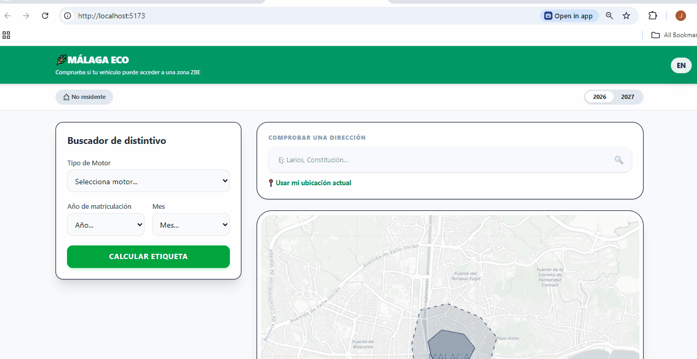

# 🚗 ZBE Málaga Checker: Smart Zone Navigator

A practical, interactive tool designed to help drivers navigate the new Low Emission Zones (ZBE) in Málaga. This app translates complex environmental legislation into a simple, location-based interactive experience to help users avoid fines.

<p align="center">
  
</p>

---

## 🌟 The Problem & The Solution
Low Emission Zones are confusing. Drivers often don't know which "Label" they have, nor do they want to read through official government PDFs to find out if they can enter a specific street.

**ZBE Málaga Checker** provides immediate clarity. By simply entering a vehicle's year and fuel type, the app gives you a "Yes/No" answer based on your exact location and the current (or future) laws.

### 🚀 Core Features

* **Smart Label Calculator:** Don't know your label? No problem. Enter your car’s registration year and fuel type, and the app automatically determines your environmental sticker and the specific rules that apply to you.
* **Interactive Map & Geolocation:** Visualize the exact boundaries of Málaga's **ZONE 1 and ZONE 2**. Using your phone's GPS, the app can tell you in real-time if your current location or a specific destination is restricted.
* **Future-Proof Planning (2026/2027):** Rules change over time. The app includes a "Future Mode" to see how restrictions will tighten in 2026 and 2027, specifically handling the different rules for **residents**.
* **Smart Parking Finder:** If access is restricted for your vehicle, the app automatically queries the **OpenStreetMap (Overpass) API** to guide you to the nearest public parking lots outside the restricted area.
* **Bilingual Support:** Fully accessible in **English and Spanish**.

---

## 🧪 Reliability & Testing (Vitest)
Because traffic fines are at stake, accuracy is non-negotiable. I integrated **Vitest** to run unit and integration tests on the restriction algorithms. This ensures that the complex logic involving vehicle age, fuel types, residency status, and current/future dates is 100% accurate and bug-free.

---

## 🛠️ Tech Stack
* **Frontend:** `React 18`, `TypeScript`, `Tailwind CSS`.
* **Maps:** `Leaflet` & `React-Leaflet` for polygon rendering.
* **Testing:** `Vitest` for logic verification.
* **Data Sources:** `Overpass API` (OpenStreetMap) for live parking data.
* **Localization:** `i18next`.

---

## ⚙️ Installation & Setup
1. **Clone the repository:**
   ```bash
   git clone [https://github.com/juanzafe/zbe-malaga-checker.git](https://github.com/juanzafe/zbe-malaga-checker.git)
2. **Install dependencies:** `npm install`
3. **Run Logic test:** `npm run test`
4. **Run Development Mode:** `npm run dev`

**Developed by Juan Zamudio – Real solutions for everyday professional problems.**